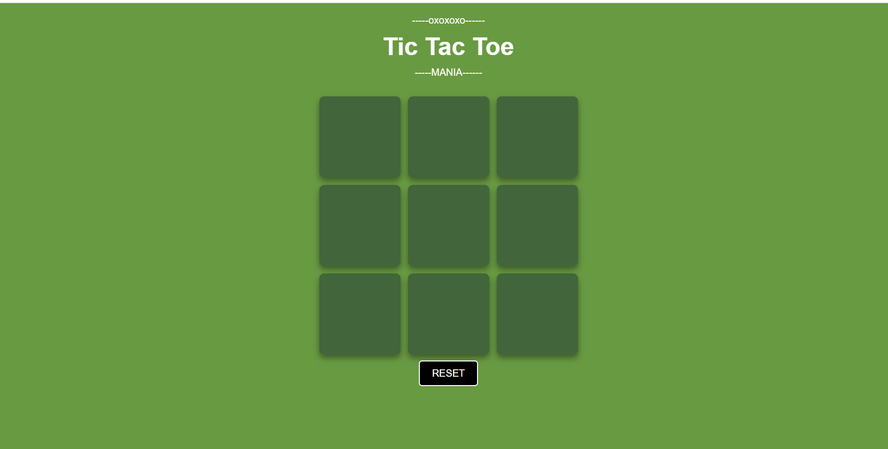
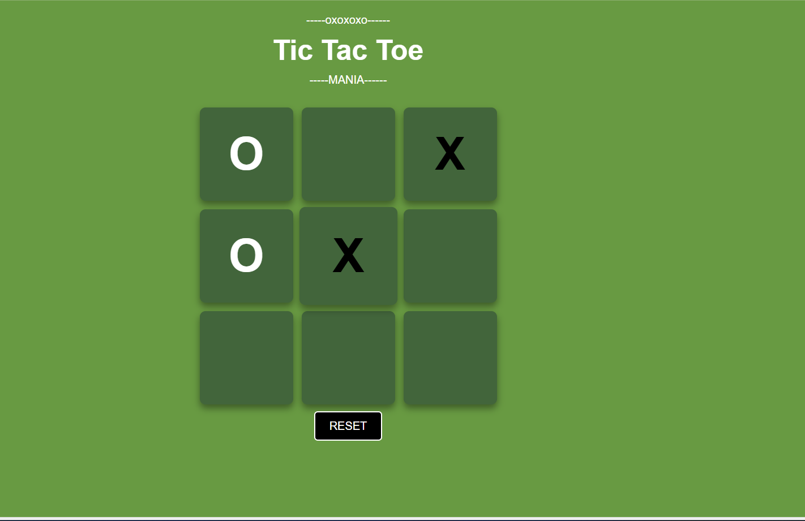
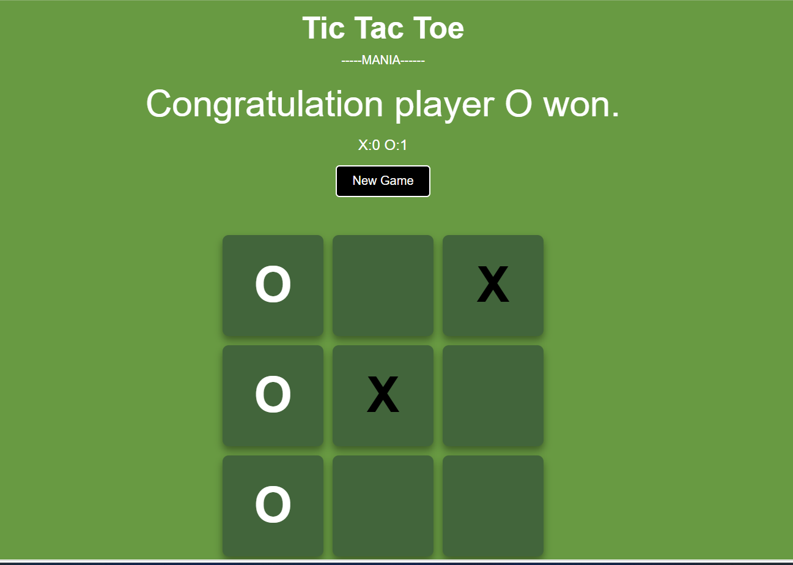

# 🎮 Tic Tac Toe

A responsive and interactive Tic Tac Toe game built using **HTML**, **CSS**, and **JavaScript**. The game allows two players to compete on the same device with automatic win detection, draw detection, and restart functionality.

---

## 🚀 Live Demo

👉 https://rananirav07.github.io/tic-tac-toe/

---

## 📸 Screenshots

### Home Screen


### Gameplay


### Winner Announcement


---

## ✨ Features

- 🎯 Two-player gameplay
- 🏆 Automatic winner detection
- 🤝 Draw detection
- 🔄 New Game button
- ♻️ Reset Game option
- 📱 Fully responsive design
- 🎨 Clean and modern user interface

---

## 🛠️ Technologies Used

- HTML5
- CSS3
- JavaScript (ES6)

---

## 📂 Project Structure

```
tic-tac-toe/
│── index.html
│── style.css
│── script.js
│── screenshot1.png
│── screenshot2.png
│── screenshot3.png
│── README.md
```

---

## ▶️ How to Run

1. Clone the repository

```bash
git clone https://github.com/YOUR_USERNAME/tic-tac-toe.git
```

2. Open the project folder.

3. Open `index.html` in any modern web browser.

---

## 📚 What I Learned

- DOM Manipulation
- Event Handling
- JavaScript Functions
- Arrays and Loops
- Conditional Logic
- Responsive Web Design
- Game State Management

---

## 📌 Future Improvements

- 🤖 Add AI opponent
- 🌙 Dark Mode
- 🔊 Sound Effects
- 💾 Scoreboard
- 🌐 Online Multiplayer

---

## 👨‍💻 Author

**Nirav Rana**

GitHub: https://github.com/rananirav07
